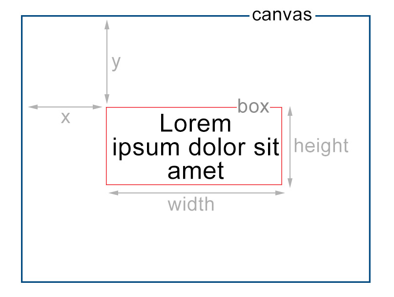

<div align="center">

<h3>Canvas Txt 📐</h3>
<p>
Transforming Your Canvas with Multiline Magic ✨
</p>

<p align="center">


</p>

#### A Miniscule library to render text on HTML5 Canvas with ZERO dependencies

</div>

## Features

- [x] Multiline text
- [x] Rich text formatting (with the exception of words with different font _sizes_ not yet working well in terms of text baseline alignment)
- [x] Auto line breaks
- [x] Horizontal Align
- [x] Vertical Align
- [x] Justify Align
- [x] Easy Debugging
- [x] Improved Performance

## Demo

See Demo: [Here](https://canvas-txt.geongeorge.com)

## Install

```bash
yarn add canvas-txt
# or
npm i canvas-txt
```

# Usage

```html
<canvas id="myCanvas" width="500" height="500"></canvas>
```

## Bundler

```javascript
import { drawText } from 'canvas-txt'

const c = document.getElementById('myCanvas')
const ctx = c.getContext('2d')

ctx.clearRect(0, 0, 500, 500)

const text = 'Lorem ipsum dolor sit amet'

const { height } = drawText(ctx, text, {
  x: 100,
  y: 200,
  width: 200,
  height: 200,
  fontSize: 24,
})

console.log(`Total height = ${height}px`)
```

## Node canvas

See Node js demo in [./src/node-test.ts](https://github.com/geongeorge/Canvas-Txt/blob/master/src/node-test.ts)

```js
const { createCanvas } = require('canvas')
const { drawText } = require('canvas-txt')
const fs = require('fs')

// Or
// import { createCanvas } from 'canvas'
// import { drawText } from 'canvas-txt'
// import * as fs from 'fs'

function main() {
  const canvas = createCanvas(400, 400)
  const ctx = canvas.getContext('2d')
  const text = 'Hello World!'

  const { height } = drawText(ctx, text, {
    x: 100,
    y: 200,
    width: 200,
    height: 200,
    fontSize: 24,
  })

  // Convert the canvas to a buffer in PNG format
  const buffer = canvas.toBuffer('image/png')
  fs.writeFileSync('output.png', buffer)
  console.log(`Total height = ${height}px`)
}

main()
```

## CDN

See fiddle : https://jsfiddle.net/geongeorgek/n5xw3ufj/2/

```html
<script src="//unpkg.com/canvas-txt"></script>
```

```javascript
const { drawText, getTextHeight, splitText } = window.canvasTxt
/// ...remaining same
```



## drawText config properties

|  Properties   |   Default    | Description                                                                    |
| :-----------: | :----------: | :----------------------------------------------------------------------------- |
|    `width`    | **Required** | Width of the text box                                                          |
|   `height`    | **Required** | Height of the text box                                                         |
|      `x`      | **Required** | X position of the text box                                                     |
|      `y`      | **Required** | Y position of the text box                                                     |
|    `debug`    |   `false`    | Shows the border and align gravity for debugging purposes                      |
|    `align`    |   `center`   | Text align. Other possible values: `left`, `right`                             |
|   `vAlign`    |   `middle`   | Text vertical align. Other possible values: `top`, `bottom`                    |
|    `font`     |   `Arial`    | Font family of the text                                                        |
|  `fontSize`   |     `14`     | Font size of the text in px                                                    |
|  `fontStyle`  |     `''`     | Font style, same as css font-style. Examples: `italic`, `oblique 40deg`        |
| `fontVariant` |     `''`     | Font variant, same as css font-variant. Examples: `small-caps` |
| `fontWeight`  |     `'400'`     | Font weight, same as css font-weight. Examples: `bold`, `100`                  |
|   `justify`   |   `false`    | Justify text if `true`, it will insert spaces between words when necessary.    |
|   `inferWhitespace`   |   `true`    | If whitespace in the text should be inferred. Only applies if the text given to `drawText()` is a `Word[]`. If the text is a `string`, this config setting is ignored.     |

## Methods

```js
import {
  drawText,
  specToJson,
  wordsToJson,
  splitText,
  splitWords,
  textToWords,
  getTextHeight,
  getWordHeight,
  getTextStyle,
  getTextFormat,
} from 'canvas-txt'
```

- `drawText()`: Draws text (`string` or `Word[]`) to a given Canvas.
- `specToJson()`: Converts a `RenderSpec` to a JSON string. Useful for sending it as a message through `Worker.postMessage()`.
- `wordsToJson()`: Converts a `Word[]` to a JSON string. Useful for sending it as a message to a Worker thread via `Worker.postMessage()`.
- `splitText()`: Splits a given `string` into wrapped lines.
- `splitWords()`: Splits a given `Word[]` into wrapped lines.
- `textToWords()`: Converts a `string` into a `Word[]`. Useful if you want to then apply rich formatting to certain words.
- `getTextHeight()`: Gets the measured height of a given `string` using a given text style.
- `getWordHeight()`: Gets the measured height of a given `Word` using its text style.
- `getTextStyle()`: Generates a CSS Font `string` from a given `TextFormat` for use with `canvas.getContext('2d').font`
- `getTextFormat()`: Generates a "full" `TextFormat` object (all properties specified) given one with only partial properties using prescribed defaults.

TypeScript integration should provide helpful JSDocs for every function and each of its parameters to further help with their use.
